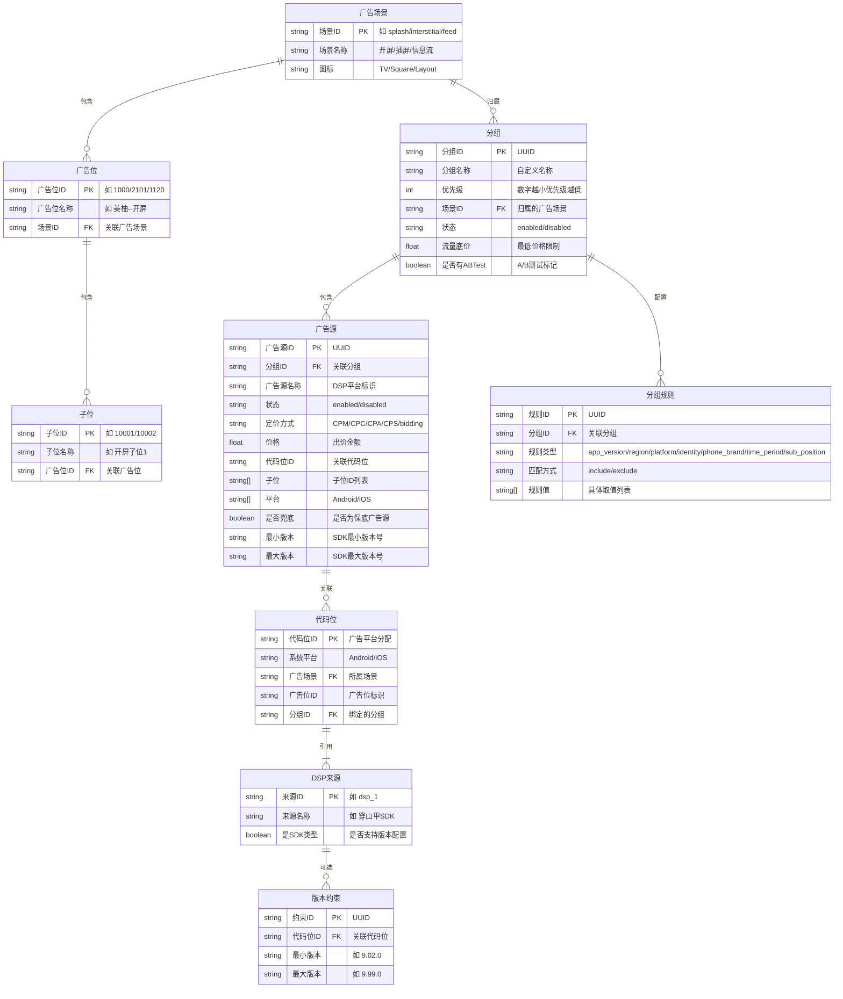
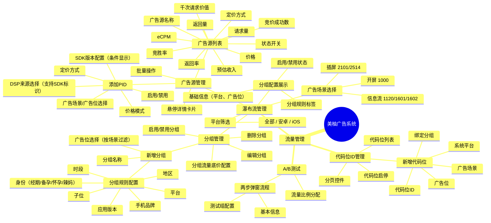
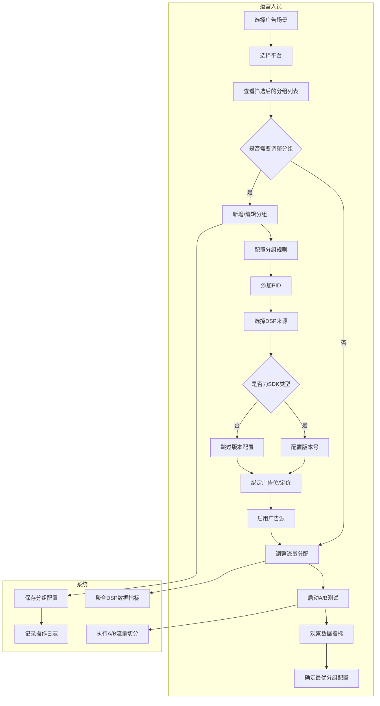
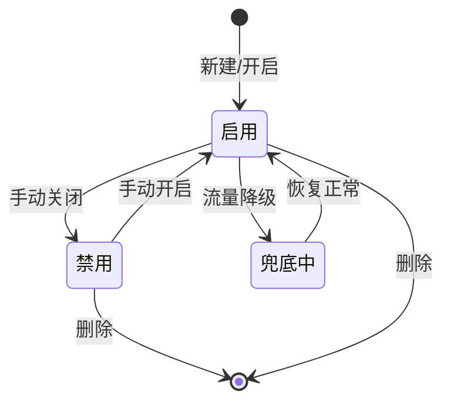

# 产品需求文档（PRD）— 美柚广告瀑布流管理系统

## 文档信息

| 项目名称 | 美柚广告系统 - 瀑布流管理模块 |
|:---------|:-----------------------------|
| 文档版本 | V1.0 |
| 撰写人 | AI 产品助手 |
| 撰写日期 | 2026-05-19 |
| 最后更新 | 2026-05-19 |

---

## 1. 需求背景

### 1.1 业务大背景

美柚作为国内领先的女性健康互联网平台，广告收入是核心商业变现方式。当前广告系统流量管理能力以人工配置为主，缺乏可视化、灵活的分组管理和实时数据反馈。为支撑广告业务规模化增长，提升运营效率，需建设一套标准化的瀑布流管理系统，对标穿山甲/ToBid 等业界成熟平台。

### 1.2 业务子背景

流量运营团队在日常工作中面临以下痛点：
- **分组管理低效**：广告位与DSP来源的绑定关系通过表格/文档维护，配置易出错、难追溯
- **数据查看分散**：各DSP来源的请求量、返回量、eCPM等核心指标需登录多个后台查看，无法统一对比
- **版本管理缺失**：SDK类型DSP来源的版本约束缺乏配置入口，流量分发不可控
- **代码位管理混乱**：代码位ID（PID）的创建、绑定分组、启停操作无统一管理界面

### 1.3 现状判断及问题

| 现状 | 问题判断 | 解决方案 |
|:-----|:---------|:---------|
| 广告分组通过Excel维护，每次调整需走研发排期 | 配置效率低，业务响应慢 | 建设可视化瀑布流管理后台，支持运营自助配置分组和广告源 |
| DSP来源数据分散在各平台，需手动汇总对比 | 数据获取成本高，决策缺乏实时依据 | 集成各DSP来源的指标数据，统一列表展示，支持排序和对比 |
| SDK版本号仅写在备注中，无标准化配置入口 | 版本控制缺失，流量分发不精准 | 在PID级别增加版本号配置字段，格式标准化为 `x.y.z` |
| PID创建依赖研发手动操作，无自服务能力 | 流程冗长，效率瓶颈 | 提供PID自助创建/编辑/启停功能，支持绑定分组和平台选择 |
| 分组规则（地域、人群、时段等）无配置入口 | 流量精细化运营能力不足 | 提供分组规则配置面板，支持包含/排除条件的灵活组合 |

---

## 2. 项目目标

### 2.1 目标描述

1. **提升配置效率**：实现广告分组、广告源、PID的自助化管理，运营人员可独立完成流量配置，减少对研发的依赖
2. **数据驱动决策**：聚合各DSP来源的请求量、返回量、eCPM等指标，支持数据排序和对比，辅助流量调配决策
3. **精细化流量运营**：通过分组规则（地域、人群、时段、版本等）实现流量分层分发，提升广告填充率和收益
4. **版本管控标准化**：为SDK类型DSP来源提供版本号配置能力，确保流量分发与版本兼容性一致

### 2.2 迭代节奏

| 阶段 | 内容 | 说明 |
|:-----|:-----|:-----|
| 第一阶段（MVP） | 瀑布流管理基础功能 | 分组增删改查、广告源列表展示、PID管理、平台/场景筛选 |
| 第二阶段 | 进阶能力 | 分组规则配置（地域/人群/时段/版本/子位）、A/B测试、数据报表 |
| 第三阶段 | 智能优化 | 自动调价建议、流量预测、异常告警 |

本次PRD覆盖第一、二阶段核心功能。

---

## 3. 需求方案

### 3.1 名词定义

| 名词 | 定义说明 |
|:-----|:---------|
| 瀑布流（Waterfall） | 广告请求的优先级排序策略，多个广告源按优先级顺序请求，直到有广告填充为止 |
| 广告场景（Ad Scene） | 广告展示的页面位置类型，包括：开屏、插屏、信息流、Banner、激励视频、原生 |
| 分组（Ad Group） | 同一广告场景下的流量组织单元，包含广告位、平台、规则、DSP来源等配置，每个分组只属于一个广告场景 |
| 广告位（Ad Slot） | 具体的广告展示位置ID，如 `1000` 代表美柚开屏 |
| DSP来源 | 广告需求方平台（Demand-Side Platform），如穿山甲、快手。SDK类型DSP来源支持版本号配置 |
| 代码位ID（PID） | 广告代码位的唯一标识，由广告平台分配，用于区分不同的广告位和广告源 |
| 子位（Sub Position） | 广告位下的细分位置区分，如开屏下分为开屏子位1、开屏子位2 |
| eCPM | 千次展示预估收益（Effective Cost Per Mille），是衡量广告变现效率的核心指标 |
| 定价方式 | 广告结算模式：CPM（千次展示付费）、CPC（点击付费）、CPA（行动付费）、CPS（销售分成）、bidding（竞价） |
| 兜底（Fallback） | 当所有广告源均无填充时的保底广告源，通常价格较低但填充率稳定 |
| A/B测试 | 将流量按比例分配给不同分组配置，对比效果以确定最优方案 |

### 3.2 实体关系图

### 3.3 信息结构图

### 3.4 产品流程图

#### 核心流程：瀑布流配置与流量分发

#### 状态流转：广告源状态

### 3.5 原型图

详见项目代码 Demo 页面说明，提供了完整的前端页面原型实现。

### 3.6 需求说明

#### 3.6.1 全局功能

| 页面 | 模块 | 功能 | 描述 |
|:-----|:-----|:-----|:-----|
| 全局 | 左侧导航 | 菜单切换 | 左侧固定导航栏，包含「流量管理」一级菜单，二级菜单包括「瀑布流管理」「代码位ID管理」。当前页面高亮显示（粉色背景+右边框）。点击切换时，页面内容随菜单切换 |
| 全局 | 左侧导航 | 菜单折叠 | 支持导航栏展开/折叠，折叠时仅显示图标「瀑布流管理」和「代码位ID管理」 |
| 全局 | 数据加载 | 空状态 | 后端接口加载失败时展示「数据加载失败，请刷新页面」提示，并提供刷新按钮。无数据时展示「暂无数据」和「点击新增分组」引导操作 |

#### 3.6.2 瀑布流管理 — 场景与平台筛选

| 页面 | 模块 | 功能 | 描述 |
|:-----|:-----|:-----|:-----|
| 瀑布流管理 | 顶部导航 | 广告场景切换 | 顶部Tab栏展示全部广告场景（开屏/插屏/信息流/Banner/激励视频/原生），当前选中场景高亮显示。点击切换时，页面内容按场景过滤展示。切换时保持其他筛选条件不变 |
| 瀑布流管理 | 顶部导航 | 平台筛选 | 场景Tab右侧放置「平台」下拉选择器，选项为「安卓」「iOS」，默认选中「iOS」。选择后页面按场景+平台双重过滤展示分组。**业务逻辑**：每个分组创建时绑定特定广告位，广告位归属于唯一广告场景，故同一分组不会跨场景显示 |
| 瀑布流管理 | 顶部导航 | 日期选择 | 场景Tab右侧提供日期区间选择器，默认为近7天 |
| 瀑布流管理 | 顶部导航 | 场景-平台联动 | 场景切换时，保持平台选择不变。平台切换时，场景选择不变。两种筛选条件组合使用，筛选结果取交集 |

#### 3.6.3 瀑布流管理 — 分组管理

| 页面 | 模块 | 功能 | 描述 |
|:-----|:-----|:-----|:-----|
| 瀑布流管理 | 分组管理区 | 查看分组列表 | 展示当前场景+平台筛选下的所有分组列表。每个分组展示为Tab标签（分组名称），默认分组固定在列表中第一个展示。未启用分组的名称以灰色显示 |
| 瀑布流管理 | 分组管理区 | 新增分组 | 点击「新建分组」按钮弹出表单弹窗。必填字段：分组名称、广告位（按当前场景过滤，多选）、优先级（正序排列，默认5分）。**边界场景**：至少选择一个广告位才能保存；优先级相同的分组，按创建时间排序 |
| 瀑布流管理 | 分组管理区 | 编辑分组 | 点击分组区域「编辑」按钮，弹窗预填充已有数据。编辑时「广告位」选项按当前场景过滤展示，只展示属于当前场景的广告位，避免跨场景误操作 |
| 瀑布流管理 | 分组管理区 | 删除分组 | 点击分组「删除」按钮，弹出二次确认弹窗「确定要删除此分组吗？删除后不可恢复」。**边界场景**：分组下存在已启用的广告源时，禁止删除并提示「请先停用分组下所有广告源」 |
| 瀑布流管理 | 分组管理区 | 启用/禁用分组 | 分组Tab旁的开关控制整个分组的启用/禁用状态。禁用分组时，**二次确认**提示「确定要禁用此分组吗？禁用后该分组流量将不再分发」 |
| 瀑布流管理 | 分组管理区 | 流量底价配置 | 每个分组可配置「流量底价」，低于此价格的广告源将不会参与竞价或展示 |

#### 3.6.4 瀑布流管理 — 分组规则配置

| 页面 | 模块 | 功能 | 描述 |
|:-----|:-----|:-----|:-----|
| 瀑布流管理 | 分组配置面板 | 基础信息展示 | 展示当前分组的平台（安卓/ iOS标签）、广告位（按当前场景过滤显示） |
| 瀑布流管理 | 分组配置面板 | 分组规则标签 | 展示已配置的分组规则，每条规则以标签形式展示，如「身份→包含: 经期」「时段→排除: 00:00-06:00」 |
| 瀑布流管理 | 分组规则 | 添加规则 | 点击「添加规则」弹出规则配置面板。支持的规则类型：应用版本（版本号列表）、地区（省市列表）、平台（Android/iOS）、身份（经期/备孕/怀孕/辣妈）、手机品牌（苹果/华为/小米等）、时段（7个时段）、子位（根据广告位动态获取，默认246）。每种规则支持「包含」或「排除」两种匹配方式 |
| 瀑布流管理 | 分组规则 | 规则逻辑 | 同一分组内的多条规则为「AND」关系，即需同时满足所有规则。单条规则内的多个值为「OR」关系，满足任一值即匹配该规则 |
| 瀑布流管理 | 分组规则 | 子位规则 | 选择「子位」规则类型时，下拉选项根据当前分组的广告位动态获取对应的子位ID列表。若当前广告位无子位配置，可选值列表为空或使用默认值246 |
| 瀑布流管理 | 分组规则 | 删除规则 | 点击规则标签上的「×」按钮可删除该规则，无需二次确认 |
| 瀑布流管理 | 分组规则 | 规则校验 | 新增规则时，至少选择一个值才能保存。规则类型为必选 |

#### 3.6.5 瀑布流管理 — 广告源管理（PID管理）

| 页面 | 模块 | 功能 | 描述 |
|:-----|:-----|:-----|:-----|
| 瀑布流管理 | 广告源区域 | 添加PID | 点击「添加PID」按钮，弹窗展示DSP来源选择器。左侧为可选DSP来源列表（带搜索），右侧为已选来源列表，通过双箭头或点击移动。SDK类型来源（穿山甲、快手）名称后展示灰色「SDK」标签 |
| 瀑布流管理 | 添加PID | SDK版本配置 | 当选择的DSP来源中包含SDK类型时，弹窗中展开「SDK版本配置」卡片，包含「最小版本」和「最大版本」两个输入框，版本号格式如 `9.02.0`（三位数字，以`.`分隔）。**边界场景**：最小版本可不填（不设下限），最大版本可不填（不设上限），最小版本不能大于最大版本 |
| 瀑布流管理 | 添加PID | 价格模式 | PID价格模式字段，支持选择「图片」和「视频」两种模式，并提示「图片和视频价格相同」 |
| 瀑布流管理 | 添加PID | 定价方式 | 支持CPM/CPC/CPA/CPS/bidding五种定价方式，定价方式列带注释图标 |
| 瀑布流管理 | 添加PID | 价格输入 | 输入数值价格，单位为元，最多支持2位小数 |
| 瀑布流管理 | 添加PID | 保存逻辑 | 提交时校验：至少选择一个DSP来源、定价方式必选、价格≥0。保存后该PID出现在当前分组的广告源列表中 |
| 瀑布流管理 | 广告源列表 | 列表展示 | 表格形式展示广告源。列字段：复选框、广告源名称（颜色圆点+名称+兜底标签）、状态（Switch开关）、定价方式（蓝色竞价/绿色定价标签）、价格（¥xx.xx+蓝色趋势图标/竞价显示横线）、预估收入、eCPM（带❓提示）、千次请求价值（带❓提示）、请求量、返回量、返回率（带❓提示）、竞价成功数、竞胜率（带❓提示） |
| 瀑布流管理 | 广告源列表 | 批量操作 | 支持全选当前页广告源，批量启用/禁用/删除。批量删除需二次确认「确定要删除选中的N个广告源吗？」 |
| 瀑布流管理 | 广告源列表 | 状态开关 | 单个广告源的启用/禁用Switch开关（蓝色激活态）。禁用时二次确认「确定要禁用此广告源吗？」 |
| 瀑布流管理 | 广告源列表 | 定价方式 | 展示广告源的定价方式标签：bidding(竞价)显示蓝色标签，CPM/CPC/CPA/CPS(定价)显示绿色标签。定价方式列带注释图标（❓），悬浮提示「定价方式说明」 |
| 瀑布流管理 | 广告源列表 | 价格注释 | 价格列标题旁添加 Info 注释图标，鼠标悬浮显示「图片和视频价格相同」 |
| 瀑布流管理 | 广告源列表 | 兜底标识 | 兜底广告源在名称旁展示灰色「兜底」标签，没有兜底标签的广告源即使在禁用状态下也不标识兜底 |
| 瀑布流管理 | 广告源列表 | 悬停详情 | 鼠标悬停广告源行时，显示详情卡片，展示核心配置（定价方式、价格、平台、版本）和统计数据（请求量、返回率、eCPM等） |
| 瀑布流管理 | 广告源列表 | 更多操作 | 每行最右侧提供「更多」菜单，包含：查看详情、编辑、复制、删除。删除需二次确认 |
| 瀑布流管理 | 广告源列表 | 折叠展示 | 广告源区域按启用/禁用状态分区折叠展示，已启用区域默认展开，未启用区域默认折叠 |
| 瀑布流管理 | 广告源列表 | 编辑PID | 点击「编辑」菜单项，弹窗预填充已有数据，支持修改DSP来源、价格、定价方式、版本配置等所有字段 |
| 瀑布流管理 | 广告源列表 | 复制PID | 点击「复制」菜单项，弹窗预填充源数据作为副本，名称自动添加「_复制」后缀，确认后新增一个广告源 |
| 瀑布流管理 | 广告源列表 | 价格列 | 竞价(bidding)模式的价格显示为横线「-」，定价模式显示具体金额 ¥xx.xx。价格旁有蓝色趋势图标，点击跳转价格趋势详情 |

#### 3.6.6 A/B测试

| 页面 | 模块 | 功能 | 描述 |
|:-----|:-----|:-----|:-----|
| 瀑布流管理 | A/B测试 | 创建测试 | 两步弹窗流程：第一步「基本信息」输入测试名称、选择对照组（A组）和测试组（B组）的分组，可选「复制对照组配置到测试组」；第二步「测试组瀑布流配置」调整测试组的广告源配置 |
| 瀑布流管理 | A/B测试 | 流量分配 | 支持流量比例分配设置（A组/B组各50%），可通过滑块调整分配比例 |
| 瀑布流管理 | A/B测试 | 查看结果 | A/B测试启动后，分组列表展示测试状态标识，点击可查看测试数据和结论 |
| 瀑布流管理 | A/B测试 | 结束测试 | 可手动结束A/B测试，选择将测试组配置应用到全量或回滚到对照组配置 |

#### 3.6.7 代码位ID管理

| 页面 | 模块 | 功能 | 描述 |
|:-----|:-----|:-----|:-----|
| 代码位ID管理 | 列表区 | 新增代码位 | 点击「新增代码位」按钮弹窗。必填字段：代码位ID、系统平台（安卓蓝色/iOS紫色单选）、广告场景（下拉选择）、广告位ID（按场景过滤）、绑定分组（下拉选择可选分组） |
| 代码位ID管理 | 列表区 | 代码位列表 | 表格展示所有代码位。列字段：代码位ID、系统平台（安卓蓝色标签/iOS紫色标签）、广告场景、广告位、绑定分组信息 |
| 代码位ID管理 | 列表区 | 代码位启停 | 操作列显示「× 关闭广告代码位」红色按钮（启用状态）或灰色「已关闭」文本（禁用状态）。点击关闭需二次确认「确定要关闭此代码位ID吗？」 |
| 代码位ID管理 | 列表区 | 分页 | 底部显示分页控件：首页/上一页/页码/下一页/末页，每页条数选择器（10/20/50），显示总条数「共N条」 |

#### 3.6.8 数据指标说明

| 字段 | 计算方式 | 说明 |
|:-----|:---------|:-----|
| 请求量 | 系统记录 | 广告位发起的广告请求总数 |
| 返回量 | 系统记录 | DSP来源返回广告的总数 |
| 返回率 | 返回量/请求量 | 广告请求的填充率，百分比展示 |
| 竞价成功数 | 系统记录 | 竞价成功的次数（仅bidding模式） |
| 竞胜率 | 竞价成功数/参与竞价次数 | 竞价模式下的胜出率 |
| eCPM | (预估收入/展示量)×1000 | 千次展示预估收益 |
| 预估收入 | 根据定价类型计算 | 参考填充数据估算的收入金额 |
| 千次请求价值 | (预估收入/请求量)×1000 | 每千次请求产生的价值 |
| 价格 | 运营配置 | 设定的出价/竞价起始价 |

### 3.7 对协同方需求

| 协同方 | 协作内容 | 负责人 | 时间节点 |
|:-------|:---------|:-------|:---------|
| 后端开发 | 提供瀑布流分组、广告源、DSP来源、代码位ID的CRUD API，数据聚合接口 | 研发团队 | 按迭代节奏 |
| 数据平台/BI | 提供DSP来源的请求量、返回量、eCPM等数据指标接口 | 数据团队 | 迭代二 |
| 运营团队 | 配合测试及验收，提供分组规则配置的实际业务需求 | 流量运营 | 全阶段 |
| UI/UX 设计 | 完善高保真原型，覆盖异常/空状态页面 | 设计团队 | 迭代一 |
| QA | 编写测试用例，覆盖业务逻辑、边界场景和异常流程 | 测试团队 | 全阶段 |

---

## 附录

### 相关文档
- 项目源码：`/workspace/projects/src/app/page.tsx`（原型页面）
- 类型定义：`/workspace/projects/src/lib/waterfall-types.ts`
- 项目规范：`/workspace/projects/AGENTS.md`

### 关键假设与待确认项

| 编号 | 假设内容 | 状态 |
|:-----|:---------|:-----|
| H1 | 定价方式中bidding(竞价)与CPM/CPC/CPA/CPS(定价)为两类基础定价模型 | 【确认】 |
| H2 | 分组规则同一分组内多条规则为AND关系，单条规则内多值为OR关系 | 【确认】 |
| H3 | 每个分组只属于一个广告场景 | 【已确认】 |
| H4 | 版本配置作用域为「代码位（PID）级」，版本号格式如 9.02.0 | 【已确认】 |
| H5 | 系统仅展示和录入价格，实际竞价由广告平台处理 | 【已确认】 |
| H6 | 系统需自建后端服务（Next.js API Routes），数据持久化 | 【已确认】 |

### 修改记录

| 版本 | 修改日期 | 修改人 | 修改内容 |
|:-----|:---------|:-------|:---------|
| V1.0 | 2026-05-19 | AI 产品助手 | 初始版本，涵盖瀑布流管理、代码位ID管理、A/B测试模块完整需求 |